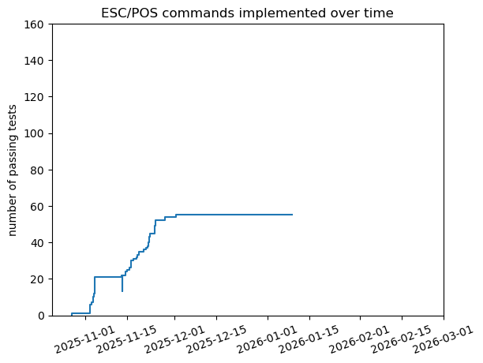

# ESC/POS parser and generator Typescript library

### Disclaimers

- Neither this project nor its authors are affiliated with Epson.
- This project is not production-ready.

### Current status

All 163 commands supported by the Epson TM-T88V have class definition stubs.

For the most up-to-date information on which commands are supported, run `npm test`.

For a recent-ish snapshot of which commands are currently supported, have a look at [support.html](https://aycyang.github.io/escpos-ts/support.html).
